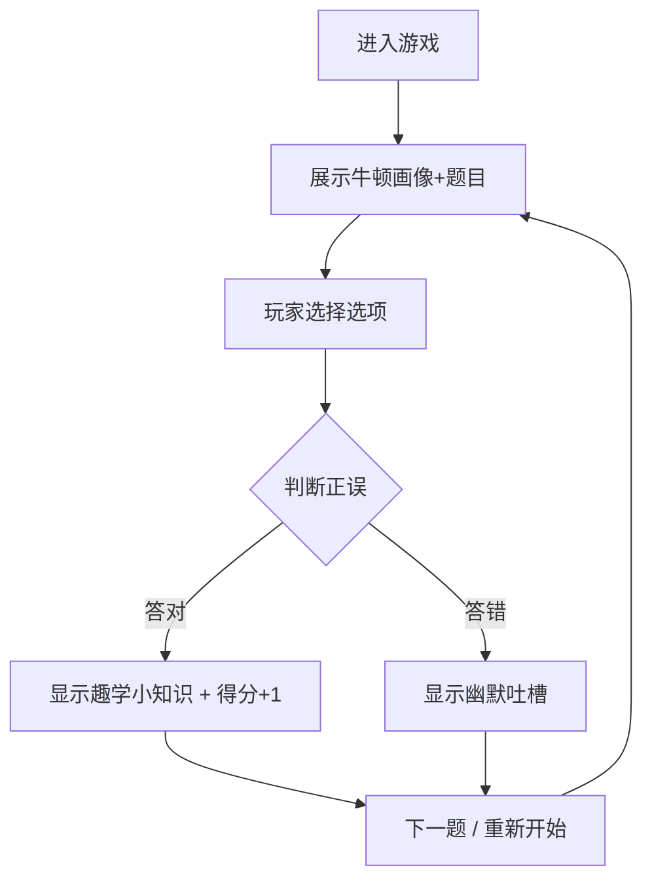

## 1. 产品概述

一个趣味物理学家问答 Web 小游戏，玩家挑战关于牛顿的趣味选择题，在欢笑中学习物理知识。核心体验是"被苹果砸中的牛顿"这一经典场景的幽默演绎。

- 目标用户：对科学感兴趣的休闲游戏玩家、学生群体
- 产品价值：用幽默方式降低物理学习门槛，让科学知识变得有趣易记

## 2. 核心功能

### 2.1 功能模块

1. **游戏主页面**：物理学家画像、趣味选择题、选项交互、得分计数器

### 2.2 页面详情

| 页面名称 | 模块名称 | 功能描述 |
|----------|----------|----------|
| 游戏主页面 | 物理学家画像区 | 展示牛顿的趣味卡通画像，配合场景装饰元素 |
| 游戏主页面 | 题目卡片区 | 展示趣味选择题"牛顿被苹果砸后最先想到什么"，包含三个选项 |
| 游戏主页面 | 选项交互区 | 点击选项后展示答题结果：答对显示趣学小知识，答错显示幽默吐槽 |
| 游戏主页面 | 得分计数器 | 实时显示当前得分，答题后动态更新 |

## 3. 核心流程

玩家进入游戏页面，看到牛顿画像和趣味选择题，点击一个选项后：
- 若答对：显示趣学小知识弹窗，得分+1
- 若答错：显示幽默吐槽弹窗，不得分
- 可点击继续挑战下一题或重新开始

## 4. 用户界面设计

### 4.1 设计风格

- 主色调：暖橙色 (#FF6B35) + 深墨绿 (#1A3C34)，搭配奶白色背景
- 辅助色：金黄色用于得分高亮，红色用于错误提示
- 按钮风格：圆角胶囊形按钮，带微妙的3D阴影效果
- 字体：标题使用俏皮的手写风字体，正文使用清晰的无衬线字体
- 布局风格：居中卡片式布局，带漂浮装饰元素
- 图标/Emoji风格：使用科学主题的趣味装饰（苹果、原子、星球等）

### 4.2 页面设计概览

| 页面名称 | 模块名称 | UI元素 |
|----------|----------|--------|
| 游戏主页面 | 画像区 | 圆形头像框，牛顿卡通画像，漂浮苹果装饰动画 |
| 游戏主页面 | 题目卡片 | 圆角卡片容器，题目文字居中，底部三个选项按钮 |
| 游戏主页面 | 结果弹窗 | 半透明遮罩 + 居中弹窗卡片，显示知识点或吐槽文案 |
| 游戏主页面 | 得分计数器 | 右上角固定定位，金色数字 + 星星图标 |

### 4.3 响应式设计

- 桌面优先设计，移动端自适应
- 卡片容器最大宽度480px，居中显示
- 触摸优化：选项按钮最小点击区域44px

### 4.4 动画效果

- 苹果下落动画（页面加载时）
- 选项悬停缩放效果
- 答对时撒花/星星粒子效果
- 答错时卡片抖动效果
- 得分更新时数字弹跳动画
