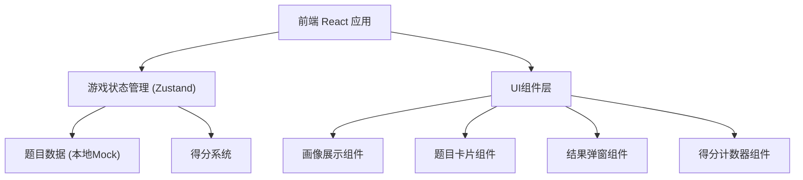

## 1. 架构设计



## 2. 技术说明

- 前端：React@18 + Tailwind CSS@3 + Vite
- 初始化工具：vite-init
- 后端：无（纯前端应用）
- 数据库：无（使用本地 Mock 数据）
- 状态管理：Zustand

## 3. 路由定义

| 路由 | 用途 |
|------|------|
| / | 游戏主页面，包含所有游戏逻辑 |

## 4. 数据模型

### 4.1 题目数据结构

```typescript
interface Question {
  id: number;
  physicist: string;
  portraitUrl: string;
  question: string;
  options: Option[];
  correctOptionId: number;
  funFact: string;
  wrongRoast: string;
}

interface Option {
  id: number;
  text: string;
  isHilarious: boolean;
}
```

### 4.2 游戏状态

```typescript
interface GameState {
  currentQuestionIndex: number;
  score: number;
  selectedOptionId: number | null;
  showResult: boolean;
  isCorrect: boolean | null;
  selectOption: (optionId: number) => void;
  nextQuestion: () => void;
  resetGame: () => void;
}
```
